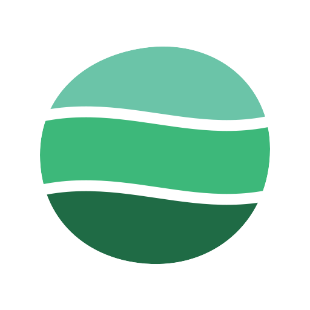

<div align="center">



# Nephrite website

**English** · [Español](README.es.md)

The landing page for [Nephrite](https://getnephrite.dev), a calm, low-glare jade theme for Chrome, with Firefox and VS Code on the way.

[](LICENSE)
[](https://tanstack.com/start)
[](https://vercel.com)

[Live site](https://getnephrite.dev) · [Chrome theme](https://github.com/Nephrite-theme/chrome) · [Report an issue](https://github.com/Nephrite-theme/web/issues)

</div>

## Overview

A single, server-rendered landing page that presents every Nephrite variant, links each one to its Chrome Web Store listing, and tracks the roadmap across other apps. It ships in English and Spanish, with inertial scrolling and scroll-driven motion that step aside for visitors who prefer reduced motion.

## Features

- **Variant picker.** Every variant (Forest, Jade, Mint) with its palette colors and a direct Web Store link. Adding one is a data change.
- **Palette page.** The Nephrite palette at `/palette`, with copyable swatches, editor and terminal previews, and CSS or JSON export.
- **Bilingual.** English at `/`, Spanish at `/es/`, with localized metadata and `hreflang` alternates.
- **Motion with restraint.** GSAP ScrollSmoother, a pinned horizontal roadmap and scroll reveals, all disabled under `prefers-reduced-motion`.
- **SEO ready.** Canonical URLs, Open Graph and X cards, JSON-LD for the organization and each listing, `robots.txt` and `sitemap.xml`.
- **Dark jade design.** Geist type, a single jade accent and Solar icons.

## Tech stack

| Area | Tools |
| --- | --- |
| Framework | [TanStack Start](https://tanstack.com/start) + [TanStack Router](https://tanstack.com/router), React 19, Vite |
| Styling | [Tailwind CSS v4](https://tailwindcss.com), Geist via Fontsource |
| Motion | [GSAP](https://gsap.com) with ScrollTrigger and ScrollSmoother |
| i18n | [Paraglide JS](https://inlang.com/m/gerre34r/library-inlang-paraglideJs) |
| Icons | [Solar Icons](https://solar-icons.vercel.app), [Simple Icons](https://simpleicons.org) for brand marks |
| Tooling | TypeScript, [Biome](https://biomejs.dev), pnpm |
| Hosting | [Vercel](https://vercel.com) through Nitro |

## Getting started

### Prerequisites

- [Node.js](https://nodejs.org) 22 or newer
- [pnpm](https://pnpm.io) (`corepack enable` installs the right version)

### Run locally

```sh
git clone https://github.com/Nephrite-theme/web.git
cd web
pnpm install
pnpm dev
```

Open [http://localhost:3000](http://localhost:3000) for English or [http://localhost:3000/es/](http://localhost:3000/es/) for Spanish.

> [!NOTE]
> Paraglide compiles messages into `src/paraglide/` when the dev server or a build starts. The folder is generated and ignored by Git.

### Scripts

| Command | Description |
| --- | --- |
| `pnpm dev` | Start the dev server on port 3000 |
| `pnpm build` | Build for production |
| `pnpm preview` | Preview the production build |
| `pnpm check` | Lint and check formatting with Biome |
| `pnpm format` | Format the code with Biome |

## Project structure

```text
messages/            Copy for each locale (en.json, es.json)
project.inlang/      Paraglide settings and locale list
public/              Logo, favicons, OG image, robots.txt, sitemap.xml
src/
  components/
    sections/        Nav, Hero, Variants, Details, Roadmap, Closing
    ui/              Logo, PillLink, InstallMenu, Shot, Swatch
  lib/
    site.ts          Links and the list of variants
    gsap.ts          GSAP setup and shared easing
  routes/            __root.tsx (head, SEO) and index.tsx (the page)
  styles.css         Design tokens and global styles
```

## Common changes

### Add a theme variant

1. Add the flavor to [`src/lib/palette.ts`](src/lib/palette.ts) (mirroring [Nephrite-theme/palette](https://github.com/Nephrite-theme/palette)) with a `flavor_<key>_desc` message in every file in [`messages/`](messages).
2. Append an entry to `VARIANTS` in [`src/lib/site.ts`](src/lib/site.ts) with its name and Web Store URL; its colors come from the flavor.

The tabs, install menu, mobile menu and structured data pick it up automatically.

### Add screenshots

Place captures at `public/shots/<key>.webp` (1918×1030, the browser window only) and set `shot` on the matching variant. Until then, each slot shows a placeholder tinted with the variant's colors.

### Add a language

Add the locale to `locales` in [`project.inlang/settings.json`](project.inlang/settings.json), create `messages/<locale>.json`, and add the URL to [`public/sitemap.xml`](public/sitemap.xml).

> [!TIP]
> Keep the same message keys in every locale file so each page renders fully translated.

## Deployment

The site deploys to Vercel. [`vercel.json`](vercel.json) sets the TanStack Start framework preset, so importing the repository is enough. Every push to `main` triggers a production deployment.
